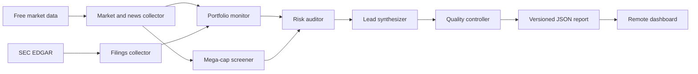

# Signal Desk

Signal Desk is a lightweight, automated research network for a focused US equity watchlist. It collects free market data and public filings before the market opens, applies deterministic technical and risk rules, and publishes an evidence-linked dashboard for human review.

It does **not** place orders, promise returns, or replace a licensed financial professional.

## What runs each morning



- **Market and news collector** retrieves six months of adjusted daily history, current quote metadata, earnings dates, and recent Yahoo Finance search results.
- **SEC filings collector** links recent 8-K, 10-Q, 10-K, 6-K, 20-F, 40-F, and proxy filings from the keyless EDGAR API.
- **Portfolio monitor** computes EMA, RSI, ATR, volume, and return signals for the configured long-term holdings.
- **Mega-cap screener** filters the configured technology universe to companies currently above the market-cap threshold and ranks mechanical 1–2 month research setups.
- **Risk auditor** flags event, volatility, and data-completeness risk and adds bounded research-only sizing heuristics.
- **Lead synthesizer** creates the morning headline from structured facts. It does not use a paid LLM or invent facts.
- **Quality controller** measures coverage, staleness, provider warnings, and source counts.

Every report includes the source links, agent execution log, and a visible data-quality score.

## Free automation and remote access

The default production path uses a public GitHub repository and GitHub Actions for the background job, plus the hosted Signal Desk URL for the dashboard:

1. Push the repository to GitHub.
2. Run **Premarket agent refresh** once from the Actions tab to create the first live report.
3. Open the hosted Signal Desk URL from any computer. The dashboard reads the newest report directly from the repository and falls back to its last bundled snapshot if GitHub is temporarily unavailable.

The scheduled workflow runs at **7:17 AM America/New_York, Monday through Friday**, a little over two hours before the regular US session. The timezone-aware schedule follows daylight-saving changes. A manual run is always available from the Actions tab.

The generated JSON in a public repository is public. Do not put account holdings, cost basis, brokerage credentials, API secrets, or other private information in the configuration or reports.

## Local run

Python 3.12+ and Node.js 22+ are recommended.

```powershell
python -m venv .venv
.\.venv\Scripts\python.exe -m pip install -r requirements.txt
$env:SEC_USER_AGENT = "SignalDesk your-email@example.com"
.\.venv\Scripts\python.exe scripts\run_agents.py
pnpm install
pnpm dev
```

Open `http://localhost:3000`. To generate a static production build, run `pnpm build`.

## Configure the coverage

Edit [`config/watchlist.yaml`](config/watchlist.yaml):

- `watchlist` is the 10-name portfolio monitor.
- `screener_universe` is the technology seed universe evaluated each run.
- `market_cap_min` defaults to $1 trillion.
- `max_candidates` controls the research queue length.
- `news_per_ticker` limits free news calls and dashboard noise.
- `archive_days` controls the small report history retained in Git.

`AAPL` is used instead of the `APPL` typo in the original brief. The other four default holdings are reasonable placeholders and should be replaced with the actual portfolio tickers.

The screener is a curated seed list that is filtered using current market cap; it is not a licensed, exchange-complete security master.

## Data boundaries

- [yfinance](https://ranaroussi.github.io/yfinance/) is open source and uses publicly available Yahoo Finance interfaces intended for personal research. Its data may be delayed, incomplete, or temporarily unavailable.
- [SEC EDGAR APIs](https://www.sec.gov/search-filings/edgar-application-programming-interfaces) are free and keyless. Set `SEC_USER_AGENT` to identify the application and a real contact email.
- The system intentionally does not scrape X, Reddit, paywalled analyst research, or YouTube by default. Those sources add terms-of-service, quota, identity, and noise concerns; the provider boundary under `agents/providers/` is the safe extension point.
- A modeled target is a transparent 3-ATR scenario bounded to the requested 10–20% range, not a probability estimate or expected return.
- Market holidays are not independently modeled; the weekday job can still publish a research refresh on a US market holiday.

## Validation

```powershell
python -m unittest discover -s tests -v
python scripts\validate_report.py public\data\latest.json
pnpm build
```

The unit suite covers indicator math, market-cap filtering, target bounds, and risk caps. The JSON validator blocks malformed scores and unsafe source URLs before scheduled data is committed.

## Repository map

```text
agents/
  providers/        free external data adapters
  nodes/            monitor, screener, risk, synthesis, quality agents
  orchestrator.py   bounded parallel collection and deterministic DAG
app/                responsive dashboard
config/             watchlist and thresholds
public/data/        latest report and 30-day archive
scripts/            runner and report validation
tests/              offline deterministic tests
.github/workflows/  premarket refresh and quality checks
```
